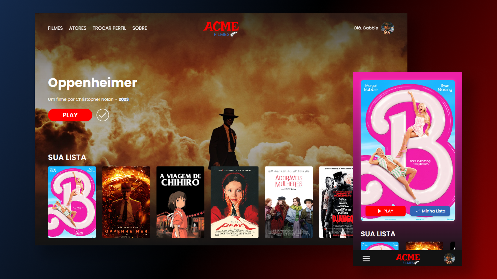

<h1 align="center"> 💙 ACME Filmes 💖 </h1>

## 🎥 Sobre o Projeto 

Acme Filmes é um projeto desenvolvido por Ryan Alves durante o curso de Desenvolvimento de sistemas do Senai de Jandira. É um projeto full-stack, com o Back-End em Node.js, o banco de dados em MySQL e o Front-End em HTML, CSS, JAVASCRIPT e TailwindCSS. Todo o processo foi orientado pelos professores @marcelnt e @fernandoleonid.

## 💻 Linguagens e Ferramentas utilizadas

    
    
    
    
    
    
    
    
    

## 🎠 Etapas do Projeto 

- [x] Referências de Design
- [x] Prototipação
- [x] Construção do HTML
- [x] Estilização
- [x] Responsividade
- [x] Utilização da API

## 📌 API Utilizada 

- [ACME Filmes Backend](https://github.com/RyanAlvesz/acme_filmes_backend)

## 🎞 Links úteis

Protótipo | FRONT-END | Landing Page 
----------|-----------|--------------
[Figma][figma] | [Repositório][frontend] | [Preview][home] 

[figma]: https://www.figma.com/design/HY6TiWQRUZbx8eoO7cKsuP/ACME-Filmes?node-id=0%3A1&t=3q0UxaoW1CUALPNA-1
[frontend]: https://github.com/RyanAlvesz/acme_filmes_frontend
[home]: https://ryanalvesz.github.io/acme_filmes_frontend/

## 🌺 Feito por

<table>
  <tr>
    <td align="center">
      <a href="https://github.com/RyanAlvesz">
         
        
          <b>Ryan Alves</b>
        
      </a>
    </td>
  </tr>   
</table>